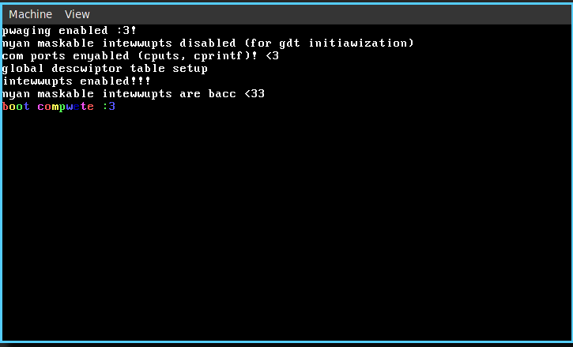

# kibby-os

hobby os

things currently implemented:

- [x] gdt
- [x] enter protected mode
- [x] printf()
- [x] com ports
- [x] idt, isrs, irqs.
- [ ] user input, scancodes
- [x] paging
- [ ] malloc, free
- [ ] user mode
- [ ] multitasking

## screenshots so far

